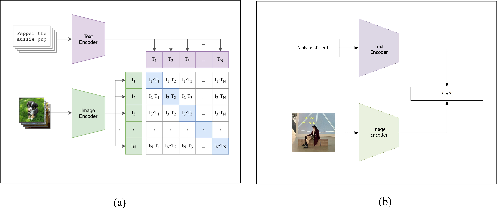

# Meta-Style:Few-Shot Learning Dataset for Social Media Field

The Meta-Style datset contains more than 36000 images belongs to 123 categories, which better reflects the performance and application value of few-shot learning algorithms in the social media domain and is scalable compared to existing datasets

### Applications

Algorithm researchers in related industries usually define various classification standards, such as dress classification, atmosphere classification and temperament classification, according to the actual business needs at different stages,and then train the corresponding classification models. This process frequently involves large-scale data collection and data annotation. It is worth noting that large-scale data collection and labelling are labor-intensive and frequent, so the corresponding needs can be better solved by the few-shot learning.

More importantly, for the social media space, tracking and creating hot topics is a significant task. For example, during 2021, the “pure-and-sexy” bloggers in TikTok suddenly became popular. So relevant algorithm engineers need to push similar style bloggers and short videos on a large scale as soon as they discover that there are precursors to the popularity of “pure-and-sexy” style. It is worth noting that only a small sample of “pure-and-sexy” style may be labeled at this time, so a few-shot learning algorithm is a reasonable way to handle the situation.

### Data Filtering Based on CLIP

It is worth noting that there are usually many unrelated pictures of users in personal social media pictures to express their mood or share other interesting things. Therefore, it is necessary to filterout irrelevant images and only retain the user’s personal style photos to avoid the impact of label noise.

### Results of Common Methods on Meta-Style

| Method                                      | Backbone | 5-way 1-shot       | 5-way 5-shot       |
| ------------------------------------------- | -------- | ------------------ | ------------------ |
| MAML                                        | ResNet12 | 31.05+- 0.35%      | /                  |
| Prototypical Networks                       | ResNet12 | 35.33+- 0.37%      | 57.62+- 0.37%      |
| Baseline++                                  | ResNet12 | 50.26 +- 0.43%     | 72.41 +- 0.35%     |
| Meta-Baseline                               | ResNet12 | 30.53 +- 0.80%     | 42.36 +- 0.35%     |
| Baseline++ with Latent Prototype Estimation | ResNet12 | **60.66 +- 0.59%** | **77.00 +- 0.37**% |

### Data Download

The dataset will be provided as soon as possible after appropriate desensitization.

### Additional Information

ATTN: This dataset is free for academic usage. For other matters, please contact Peng Yuncong(y-c.peng@qq.com)
